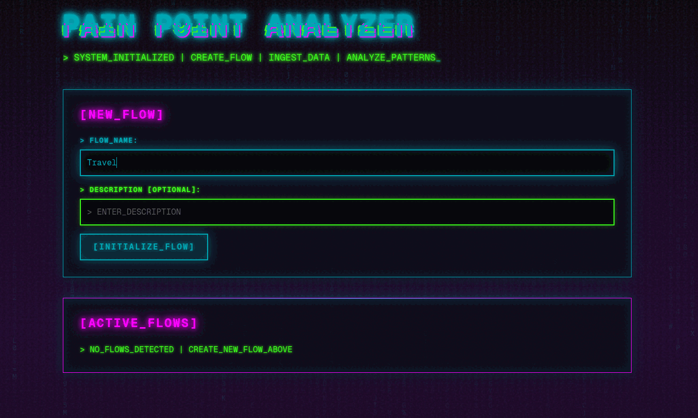
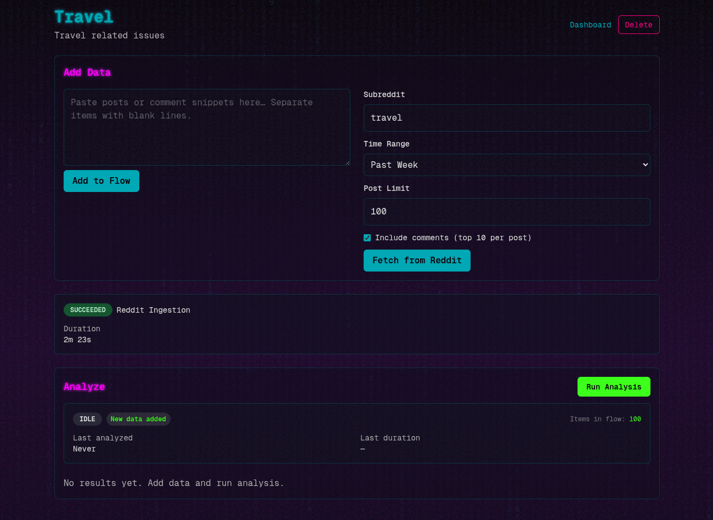

# 🌐 PAIN POINTS ANALYZER

Pain Points Analyzer is a flow-based research tool that ingests Reddit conversations or pasted text, runs a local LLM (via LM Studio) to cluster recurring problems, and surfaces micro‑SaaS ideas with linked source material. This lite-verion of the app lives in `web/`, built on the Next.js App Router with Prisma + SQLite.

> *Hack the collective subconscious: Flow Reddit subreddits through local LLMs to extract raw pain, workarounds, and micro-SaaS gold.*



## Feature Snapshot

- Flow dashboard to create, open, and delete research flows.
- Paste ingestion that splits text into individual source items.
- Reddit ingestion that fetches posts (and optional top comments) through the public JSON API with built-in throttling, smart limits, and user warnings.
- LM Studio–backed analysis that batches large datasets and writes clusters, ideas, and source links back to SQLite.
- Flow details page that shows item counts, runs analysis, and lets you expand each cluster to inspect its contributing sources with outbound Reddit links.

## Setup

```bash
git clone https://github.com/admica/PainPoints.git ~/
cd PainPoints
./install.sh
./start.sh
```

Browse to the server at `http://localhost:3000`.

### Example installation and startup output

```bash
$ ./install.sh 
[INFO] Ensuring environment file exists...
[SUCCESS] Created .env from .env.example
[INFO] Loading environment variables from ~/PainPoints/web/.env
[INFO] Installing npm dependencies in web/
[INFO] Checking LM Studio AppImage and CLI
[SUCCESS] LM Studio AppImage found at ~/Downloads/LM-Studio-0.3.31-7-x64.appimage
[SUCCESS] LM Studio CLI found at ~/.lmstudio/bin/lms
[SUCCESS] Install complete. Run ./start.sh to launch services.

$ ./start.sh
Starting PainPoints services...
[INFO] Loading environment variables from ~/PainPoints/web/.env
[INFO] LM_STUDIO_APPIMAGE_NAME is not set. Searching for LM Studio AppImage in ~/Downloads...
[SUCCESS] Found AppImage: LM-Studio-0.3.31-7-x64.appimage
[INFO] LLM_MODEL is not set. Finding the last model in the list...
[SUCCESS] Found last model: qwen/qwen3-vl-8b
[SUCCESS] Model 'qwen/qwen3-vl-8b' is available. Loading...
[INFO] Using custom context length: 25000
Loading model "qwen/qwen3-vl-8b"...
Model loaded successfully in 18.72s. (6.19 GB)
[INFO] Testing LM Studio API...
[SUCCESS] LM Studio API is responding on port 1234
[SUCCESS] Next.js development server started successfully (PID: 56978)
[SUCCESS] Next.js server is responding on port 3000
[SUCCESS] All services started!

Services running:
  - LM Studio API: http://localhost:1234
  - Next.js App:   http://localhost:3000
```

## Prerequisites

- Node.js 20+ (tested with 22.20.0)
- npm/npx
- LM Studio installed locally with a chat model loaded
- All Linux distros (there's no dnf/apt/pacman/flatpak/snap/nothin)

### Environment Variables

| Key | Description | Default |
| --- | --- | --- |
| `DATABASE_URL` | Prisma datasource (`sqlite` URI). | `file:~/dev.db` |
| `LLM_BASE_URL` | LM Studio server URL. | `http://localhost:1234` |
| `LLM_MODEL` | Model name configured inside LM Studio. | `leave empty for auto-detect` |
| `LLM_REQUEST_TIMEOUT_MS` | Abort timeout for LLM calls. | `180000` |

## Using the App

1. Visit `http://localhost:3000`.
2. Create a flow (name + optional description).
3. Inside the flow page:
   - Paste text snippets (blank-line separated) or
   - Use the Reddit form to pull posts/comments.
4. Click **Run Analysis** to trigger `/api/flows/[id]/analyze`.
5. Review clusters sorted by `totalScore`, expand “View sources” to inspect the originating items, and follow Reddit links if needed.

### Reddit Ingestion Behavior

- Uses Reddit’s public JSON endpoints so no credentials are required.
- Smart post limits guard against rate limits.
- A little over 1 sec delay precedes every Reddit request, yielding ~58 req/min (safe under Reddit’s 60 req/min cap).
- The UI estimates runtime and requires confirmation when a request will exceed ~30 s (e.g., 100 posts with comments).
- The ingest API creates the `FlowSource` only after successful fetches, so invalid subreddits or empty results do not pollute the database.

### Analysis Pipeline

- `/api/flows/[id]/analyze` pulls every `SourceItem` for the flow, batches inputs in chunks of 100, and calls `extractClustersWithLlm`.
- `web/src/lib/llm.ts` enforces health checks, timeouts, and JSON validation via Zod before persisting anything.
- Each run wipes previous clusters/ideas for the flow inside a single Prisma transaction to keep results consistent.

## Architecture

| Layer | Details |
| --- | --- |
| UI | Next.js 16 App Router (`web/src/app`) with Tailwind CSS 4 theme overrides for the cyberpunk look. |
| API | Route handlers under `web/src/app/api` power flow CRUD, ingestion, analysis, and health checks. |
| Data | SQLite database at `web/dev.db` (also `web/prisma/dev.db` for migrations) accessed via Prisma 6 generated client in `web/src/lib/prisma.ts`. |
| LLM | LM Studio OpenAI-compatible server (`LLM_BASE_URL`, default `http://localhost:1234`) called from `web/src/lib/llm.ts`. |
| Reddit | `web/src/lib/reddit.ts` wraps the public JSON endpoints with a 1.033 s token bucket, automatic retries, and normalization helpers. |

```
web/
├─ src/
│  ├─ app/               # App Router pages + API routes
│  ├─ components/        # Client components (forms, buttons)
│  ├─ lib/               # Prisma + LLM + Reddit helpers
│  └─ generated/prisma/  # Prisma client output
├─ prisma/               # Schema + migrations
├─ package.json
└─ README.md (this doc)
```

## API Reference

| Method | Endpoint | Purpose |
| --- | --- | --- |
| `GET` | `/api/flows` | List flows ordered by creation date. |
| `POST` | `/api/flows` | Create a new flow. |
| `GET` | `/api/flows/[id]` | Fetch flow details (sources, latest 50 items, clusters + members). |
| `DELETE` | `/api/flows/[id]` | Delete a flow (cascade via Prisma). |
| `POST` | `/api/flows/[id]/ingest` | Accepts `{ type: "paste", text }` or `{ type: "reddit", subreddit, timeRange, limit, includeComments }`. |
| `POST` | `/api/flows/[id]/analyze` | Run LM Studio clustering + idea generation. |
| `GET` | `/api/health` | Returns working directory, `DATABASE_URL`, and whether `prisma/dev.db` exists. |

## Data Model (Prisma)

- `Flow`: container for a research project.
- `FlowSource`: metadata for pasted or Reddit imports; JSON `params` capture subreddit/timeRange/etc.
- `SourceItem`: normalized post/comment or pasted snippet; linked to `FlowSource`.
- `Cluster`: a grouped pain point with optional score JSON + relationships to members and one `Idea`.
- `ClusterMember`: joins `SourceItem` to `Cluster`.
- `Idea`: stores pain/workaround/solution text plus confidence.

See `web/prisma/schema.prisma` or the generated models under `web/src/generated/prisma/`.

## Testing & Verification

1. Create a flow and open it.
2. Add pasted snippets of text; confirm the success toast and item count update.
3. Fetch Reddit posts (try a valid subreddit plus an invalid one to confirm error handling).
4. Run analysis with LM Studio online; watch the button state and ensure clusters appear.
5. Expand cluster sources to confirm Reddit metadata and external links render.
6. Hit `/api/health` to confirm database wiring if you suspect environment issues.



## Troubleshooting

- **Analysis fails immediately**: ensure LM Studio is running and `LLM_BASE_URL` is correct; `/api/flows/[id]/analyze` checks health first and returns `503` if unreachable.
- **Reddit errors**: the API returns descriptive errors for 404, 403, and rate-limit cases; reduce post limits or wait before retrying.
- **Database path issues**: align `DATABASE_URL` across `.env`, `npx prisma migrate dev`, and runtime; absolute paths help when running scripts outside `web/`.
- **Environment issues**: startup automatically creates `web/.env` from `web/.env.example` so you can delete .env or edit manually to set parameters.

The application state described here is for the lite-version of my application. This should give you a short & sweet insight into the full capabilities of the fully operational death star. No license.
